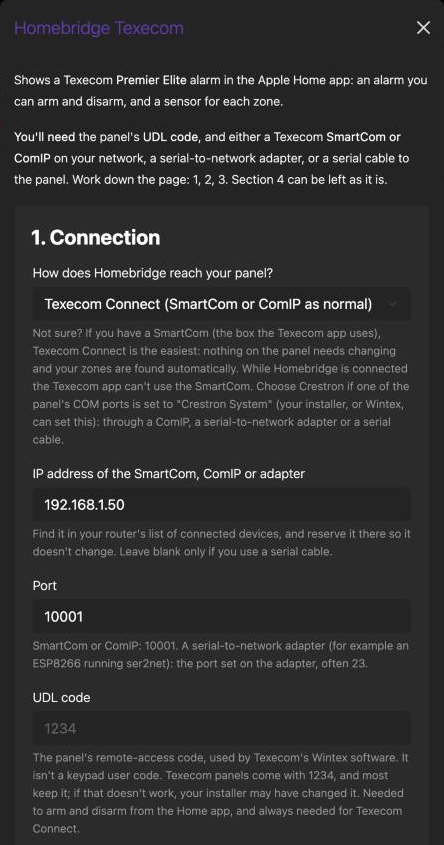
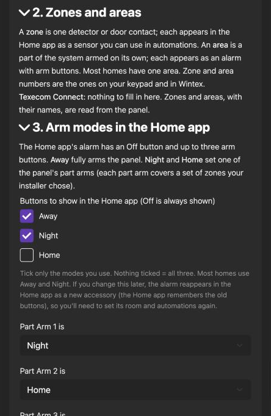
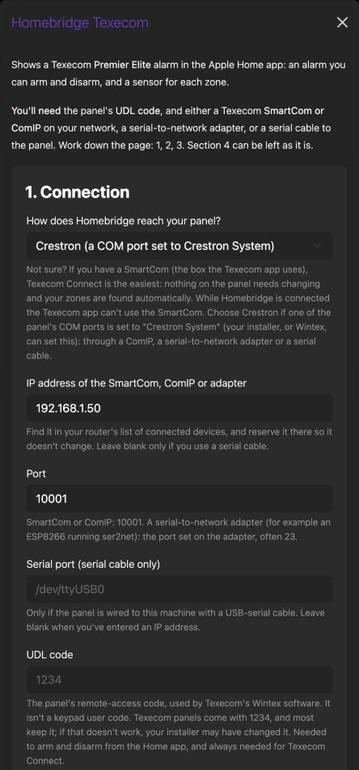
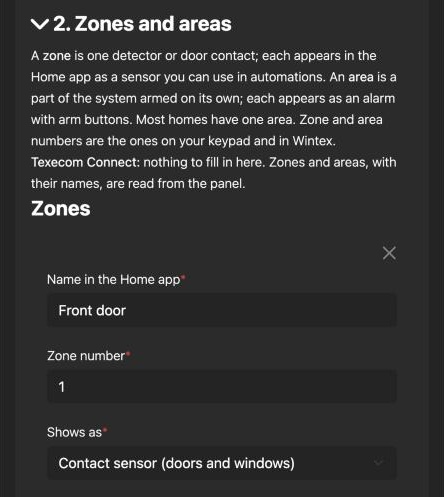
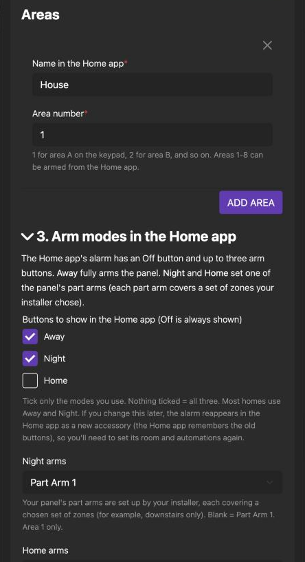
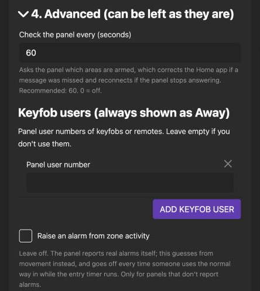

[](https://www.npmjs.com/package/homebridge-texecom-full)
[](https://www.npmjs.com/package/homebridge-texecom-full)
[](https://github.com/homebridge/homebridge/wiki/Verified-Plugins)

> ## About this fork
>
> This is a **review and demonstrator fork** of [homebridge-texecom-full](https://github.com/K1LL3R234/homebridge-texecom), offered to its maintainer to adopt as they see fit. It isn't published to npm.
>
> - **What was found and fixed, with evidence:** [docs/MAINTAINER-REVIEW.md](docs/MAINTAINER-REVIEW.md). Everything was tested on a real Premier Elite 24, and the fork runs as the live plugin on that system.
> - **New: Texecom Connect support** for a SmartCom or ComIP left in its normal mode: zones and areas read from the panel, exact arm modes, no delay after arming from the Home app.
> - **Crestron mode** keeps working, with the fixes from the review, an exact part arm for Night and Home, and a regular status check.
> - **A rewritten settings page** that explains every option (screenshots below).

# Homebridge Texecom

Shows a Texecom **Premier Elite** intruder alarm in the Apple Home app:

- **an alarm** you can arm (Away, Night, Home) and disarm, which shows when it's armed or going off;
- **a sensor for each zone** (motion, door/window contact, smoke or carbon monoxide), for automations and notifications.

Get notified when the alarm goes off, or only when you're away:


Or turn the lights on when a detector sees movement:


## What you need

1. A Texecom **Premier Elite** panel. The Texecom Connect option needs firmware v4 or later, which most panels have.
2. The panel's **UDL code**. Texecom panels come with **1234** and most keep it; if that doesn't work, your installer may have changed it. This isn't a keypad user code.
3. One way for Homebridge to reach the panel:
   - a Texecom **SmartCom** or **ComIP** on your network (the most common), or
   - a serial-to-network adapter on one of the panel's COM ports (for example an ESP8266 running ser2net), or
   - a USB-serial cable from the panel to the machine running Homebridge.

## Step 1: choose a protocol

Most people connect through their **SmartCom**: the small Texecom box next to the panel that the Texecom app uses. This plugin can talk to it in one of two ways, called **protocols**. This is the one decision you need to make; you pick it at the top of the plugin's settings.

| Protocol | **Texecom Connect** (recommended) | **Crestron** |
|---|---|---|
| What you do to the SmartCom | Nothing: leave it as it is | Switch its COM port to "Crestron System" in the panel's engineer menu |
| Texecom app | Can't connect while Homebridge is connected. Alarm notifications from the app still arrive | **Stops working**, including its notifications |
| Zones and areas | Found automatically, with their names | You type them in |
| Night / Home / Away in the Home app | Always the exact mode, however it was armed | Exact when armed from the Home app; arms from the keypad show as one mode you choose |
| "Arming…" while the exit timer runs | Yes, until the panel has finished arming | From the keypad, yes; from the Home app it shows armed as soon as the panel accepts the command |
| After arming or disarming from the Home app | No delay | Other updates are held back for about 30 seconds |
| Track record | New in this fork; tested on a real panel | The method this plugin has always used |

### Texecom Connect

**Pros**
- Nothing to change on the panel or the SmartCom, and no installer visit.
- Zones and areas are read from the panel, so there's almost nothing to type in.
- The Home app always shows the exact arm mode, and shows "Arming…" during the exit timer.
- Arm and disarm from the Home app take effect straight away, with no holding back of updates.
- Wintex can still connect through the same SmartCom.

**Cons and known limitations**
- The Texecom app can't connect while Homebridge is connected. Its alarm notifications still reach your phone.
- When the alarm goes off, the panel briefly drops the connection to send its own alarm notification. The plugin reconnects and catches up within seconds, but a disarm sent from the Home app in that moment may need repeating.
- Needs a Premier Elite on firmware v4 or later (most are).
- New: well tested on one real panel, but not yet on many.

### Crestron

**Pros**
- The plugin's original method, used by its existing users for years.
- A simple, steady connection; the panel keeps sending updates when the alarm goes off.

**Cons and known limitations**
- The Texecom app stops working, and with it the app's notifications, because the SmartCom is no longer working as a SmartCom. You'd rely on the Home app for notifications.
- Someone has to change the COM port in the panel's engineer menu (you need the engineer code, or your installer).
- You list your zones yourself, with their numbers.
- Arms made at the keypad or with a keyfob show as one mode you choose, because the panel doesn't say which mode it was.
- After you arm or disarm from the Home app, the panel holds back its other updates for about 30 seconds. Nothing is lost, but sensors update late during that time.

### Recommendation

- **You have a SmartCom and are happy to use the Home app instead of the Texecom app: choose Texecom Connect.** It's the least work and gives the best result.
- **You want to keep the Texecom app working as well:** neither option keeps it fully. Connect blocks the app while Homebridge is connected but keeps its alarm notifications; Crestron loses the app entirely. So Connect is still the better choice.
- **Already using this plugin with Crestron:** there's no need to change. The fixes in this fork apply to Crestron too.

<details>
<summary>Other ways to connect (need extra hardware)</summary>

If you want to keep the Texecom app fully working on its SmartCom, you can add a second connection on a spare COM port of the panel, set to "Crestron System", and use the **Crestron** protocol through it:

- a Texecom **ComIP** module;
- a serial-to-network adapter, e.g. an ESP8266 running ser2net (for the technically minded);
- a USB-serial cable from the panel to the machine running Homebridge.

</details>

## Step 2: follow the guide for your protocol

Open the guide for the protocol you chose. Each one takes you from the panel to the Home app.

<details>
<summary><b>Guide: Texecom Connect</b> (SmartCom left as it is)</summary>

### 1. Check the SmartCom

Nothing to change if the Texecom app works with your SmartCom today. The only thing that would stop the plugin is **Encrypted Ports**: if you've turned that on in Wintex, turn it off for the SmartCom's port.

Close the Texecom app on your phone before you start; while Homebridge is connected, the app can't connect.

### 2. Fill in the settings

In the Homebridge UI, open **Plugins**, find **Homebridge Texecom** and choose **Settings**.



1. **How does Homebridge reach your panel?** Texecom Connect.
2. **IP address:** the SmartCom's address. Find it in your router's list of connected devices, and reserve it there so it doesn't change.
3. **Port:** 10001.
4. **UDL code:** usually **1234** (see [What you need](#what-you-need)).



5. **Zones and areas:** nothing to fill in. They're read from the panel, with their names.
6. **Buttons to show in the Home app:** tick the ones you use. **Most homes: Away and Night.**
7. **Part Arm 1 / 2 / 3 is:** which Home app button sets each of your panel's part arms. The defaults (Part Arm 1 = Night, Part Arm 2 = Home) suit most homes. A part arm arms only some zones (for example downstairs only, at night); your installer set up which zones each covers.
8. **Advanced:** **Keep the panel clock right: 24** is a good choice. Leave the rest as it is.

Click **Save** and restart Homebridge.

### 3. Check it works

The Homebridge log should show `Connect: logged in and subscribed to events`, your panel's model, and a line for each zone found. In the Home app, the alarm and a sensor for each zone appear in the default room; move them to the right rooms.

### Good to know

- **When the alarm goes off**, the panel briefly drops the connection to send its own alarm notification. The plugin reconnects and catches up within seconds.
- **Wintex** can still connect through the SmartCom while Homebridge is connected.
- **If you change the buttons ticked** later, the alarm reappears in the Home app as a new accessory (the Home app remembers an alarm's buttons), so set its room and automations again.

</details>

<details>
<summary><b>Guide: Crestron</b> (SmartCom switched to Crestron System)</summary>

### 1. Switch the SmartCom's COM port to Crestron

This stops the Texecom app working with the SmartCom. At the panel's keypad:

1. Enter the engineer code.
2. Scroll to "UDL/Digi Options", then press 8 for "Com Port Setup".
3. Scroll to the COM port the SmartCom is on (usually Com Port 1), press "No" to edit, press 8 for "Crestron System", and "Yes" to save.
4. Check the UDL code under "UDL" while you're there.
5. Press "Menu" repeatedly to leave the engineer menu.

The SmartCom keeps the network settings it already had. (The same steps apply to a ComIP. If you're adding a new one, set it up and check it works first, then switch its port to Crestron.)

### 2. Fill in the settings

In the Homebridge UI, open **Plugins**, find **Homebridge Texecom** and choose **Settings**.



1. **How does Homebridge reach your panel?** Crestron.
2. **IP address:** the SmartCom's address. Find it in your router's list of connected devices, and reserve it there so it doesn't change.
3. **Port:** 10001.
4. **Serial port:** leave blank (it's only for a USB-serial cable).
5. **UDL code:** usually **1234** (see [What you need](#what-you-need)).



6. **Zones:** add each zone you want in the Home app:
   - **Name in the Home app**: e.g. "Front door".
   - **Zone number**: as on your keypad or in Wintex (Zone 1, Zone 2…). Your installer's zone list will tell you which is which.
   - **Shows as**: *Motion sensor* for movement detectors, *Contact sensor* for door and window contacts, or smoke / carbon monoxide.
   - **Hold time**: **5000** (5 seconds) for motion detectors, so a moment of movement still triggers automations; 0 for door contacts.
7. **Areas:** most homes have one: **Area 1** (area A on the keypad), named however you like, e.g. "House".



8. **Buttons to show in the Home app:** tick the ones you use. **Most homes: Away and Night.** Away fully arms the panel; Night and Home each set a part arm (some zones only, e.g. downstairs at night).
9. **Night arms / Home arms:** which part arm each button sets. Blank means Part Arm 1. If Home would do the same as Night, untick Home instead.
10. **Arms from the keypad or a keyfob show as:** the panel says "armed" without saying which mode, so pick how those arms appear. Away suits most homes.



11. **Advanced:** leave as it is. **Check the panel every 60 seconds** corrects the Home app if a message was missed. Add **keyfob users** (panel user numbers) only if you use keyfobs.

Click **Save** and restart Homebridge.

### 3. Check it works

The Homebridge log should show `Connected to Texecom panel via` followed by the SmartCom's address. In the Home app, the alarm and your zone sensors appear in the default room; move them to the right rooms. Walk past a detector and its sensor should show motion within a second or two.

### Good to know

- **After you arm or disarm from the Home app**, the panel holds back its other updates for about 30 seconds, then sends them all at once. Nothing is lost, but sensors update late during that time.
- **Only areas 1-8** can be armed from the Home app.
- **If you change the buttons ticked** later, the alarm reappears in the Home app as a new accessory (the Home app remembers an alarm's buttons), so set its room and automations again.

</details>

### Both protocols

- **Coming from the published plugin (4.x)?** Your config keeps working, but the Home app sees the alarm and sensors as new accessories: remove any old ones left behind, then set rooms and automations again.
- It's best to run this plugin as a [child bridge](https://github.com/homebridge/homebridge/wiki/Child-Bridges), so a problem with the alarm connection can't affect your other accessories.
- **Tamper:** each zone sensor shows the Home app's *Tampered* status when the panel reports a tamper on it.

## Troubleshooting

| What you see | Try |
|---|---|
| "Connection error" or "Reconnecting" in the log | Check the IP address and port; check nothing else (another app or plugin) is already connected to the module |
| Sensors work but arming doesn't | Check the UDL code |
| "No reply from the panel" (Crestron) | The adapter is reachable but the panel isn't answering: check the COM port is set to Crestron System and the cable |
| The alarm shows the wrong mode after a keypad arm (Crestron) | Set "Arms from the keypad or a keyfob show as", or use Texecom Connect, which reports the exact mode |

## All settings (for editing config.json directly)

Most people should use the settings page in Step 2. If you prefer to edit the config yourself: in the Homebridge UI open **JSON Config**, and add one of these blocks inside the `"platforms": [ … ]` list (with a comma between it and the block before it). The examples are complete and safe to copy; the notes under each say what to change. Don't add notes or comments inside the config itself: Homebridge won't start if the file isn't valid JSON.

### Texecom Connect example

Zones and areas are read from the panel, so this is all you need:

```json
{
    "platform": "Texecom",
    "protocol": "connect",
    "ip_address": "192.168.1.50",
    "ip_port": 10001,
    "udl": "1234",
    "homekit_modes": ["away", "night"],
    "time_sync_interval": 24
}
```

**What to change:**
- `ip_address`: your SmartCom's address. Find it in your router's list of connected devices, and reserve it there so it doesn't change.
- `ip_port`: leave at 10001.
- `udl`: your panel's UDL code, in quotes. Texecom's default is `"1234"`; if that doesn't work, your installer may have changed it.
- `homekit_modes`: the buttons you want in the Home app besides Off. Use any of `"away"`, `"night"` and `"stay"` (shown as Home). Most homes: Away and Night.
- `time_sync_interval`: how often, in hours, to check the panel clock and put it right. 24 is a good choice; 0 turns it off.

### Crestron example

```json
{
    "platform": "Texecom",
    "ip_address": "192.168.1.50",
    "ip_port": 10001,
    "udl": "1234",
    "zones": [
        { "name": "Front door", "zone_number": 1, "zone_type": "contact", "dwell": 0 },
        { "name": "Hallway", "zone_number": 2, "zone_type": "motion", "dwell": 5000 }
    ],
    "areas": [
        { "name": "House", "area_number": 1 }
    ],
    "homekit_modes": ["away", "night"],
    "night_part_arm": 1
}
```

**What to change:**
- `ip_address`: your SmartCom's address (or ComIP's, or adapter's). Find it in your router's list of connected devices, and reserve it there so it doesn't change. For a USB-serial cable instead, replace `ip_address` and `ip_port` with `"serial_device": "/dev/ttyUSB0"` (or whatever your adapter is called) and `"baud_rate": 19200`.
- `ip_port`: 10001 for a SmartCom or ComIP; for a serial-to-network adapter, the port set on it (often 23).
- `udl`: your panel's UDL code, in quotes. Texecom's default is `"1234"`.
- `zones`: one line per zone you want in the Home app, with a comma after every line except the last.
  - `name`: what the Home app calls it.
  - `zone_number`: the zone's number on your keypad or in Wintex.
  - `zone_type`: `"motion"` for movement detectors, `"contact"` for door and window contacts, `"smoke"` or `"carbonmonoxide"`.
  - `dwell`: milliseconds to keep showing "detected" after the zone clears. 5000 for motion detectors, 0 for contacts.
- `areas`: usually just one, area 1 (area A on the keypad). `name` is what the Home app calls the alarm.
- `homekit_modes`: as for Texecom Connect above.
- `night_part_arm`: which part arm (1, 2 or 3) the Night button sets. Add `"home_part_arm"` too if you show the Home button.

### Every setting

| Key | Default | What it does |
| --- | --- | --- |
| `platform` | | Must be `"Texecom"` |
| `protocol` | `"crestron"` | `"connect"` for Texecom Connect, `"crestron"` for Crestron |
| `ip_address` | | Address of the SmartCom, ComIP or adapter (from your router's device list) |
| `ip_port` | `10001` | Its port: 10001 for a SmartCom or ComIP |
| `serial_device` | | Crestron over a USB-serial cable instead of `ip_address`, e.g. `"/dev/ttyUSB0"` |
| `baud_rate` | `19200` | Speed of the panel's COM port, with `serial_device` |
| `udl` | | The panel's UDL code, in quotes (default `"1234"`). Needed to arm and disarm; always needed for Texecom Connect |
| `zones` | | Crestron: the zones to show, each with `name`, `zone_number`, `zone_type` (`"motion"`, `"contact"`, `"smoke"`, `"carbonmonoxide"`) and `dwell` (milliseconds). Texecom Connect: leave out, they're read from the panel |
| `areas` | | Crestron: the areas to show, each with `name` and `area_number`. Texecom Connect: leave out |
| `homekit_modes` | all three | Buttons in the Home app besides Off: any of `"away"`, `"night"`, `"stay"` (Home) |
| `night_part_arm` / `home_part_arm` | Part Arm 1 | Crestron, area 1: the part arm (1, 2 or 3) the Night / Home button sets |
| `part_arm_1` / `part_arm_2` / `part_arm_3` | `"night"` / `"stay"` / `""` | Texecom Connect: which Home app mode each part arm is (`"night"`, `"stay"`, `"away"`, or `""` for not used) |
| `default_arm_state` | `"away"` | Crestron: how an arm from the keypad or a keyfob is shown (`"away"`, `"night"` or `"stay"`) |
| `remote_users` | none | Crestron: panel user numbers of keyfobs, e.g. `[5, 6]`; their arms show as Away |
| `status_poll_interval` | `60` | Crestron: seconds between status checks; 0 = only after connecting |
| `time_sync_interval` | `0` | Texecom Connect: hours between panel clock checks; 0 = off |
| `trigger_from_zones` | `false` | Guess alarms from zone activity. Leave off: the panel reports real alarms |
| `debug` | `false` | Log every message from the panel, for reporting problems |

## Development

```bash
npm install
npm run lint
npm test
```

The protocol parsing and the connection/command queue are covered by unit tests that run against fake panels, so no panel is needed. `tools/` has the probes and test scripts used on the real panel.

## Credits

Original plugin by Kieran Jones, maintained by Max Christian and Chris Posthumus. Texecom Connect support builds on [texecom-connect](https://github.com/davidMbrooke/texecom-connect) (Apache-2.0) and [texecom2mqtt](https://github.com/dchesterton/texecom2mqtt-hassio) (MIT); see [lib/connect/NOTICE](lib/connect/NOTICE). Other projects that informed this fork are credited in [the review](docs/MAINTAINER-REVIEW.md#credits).
